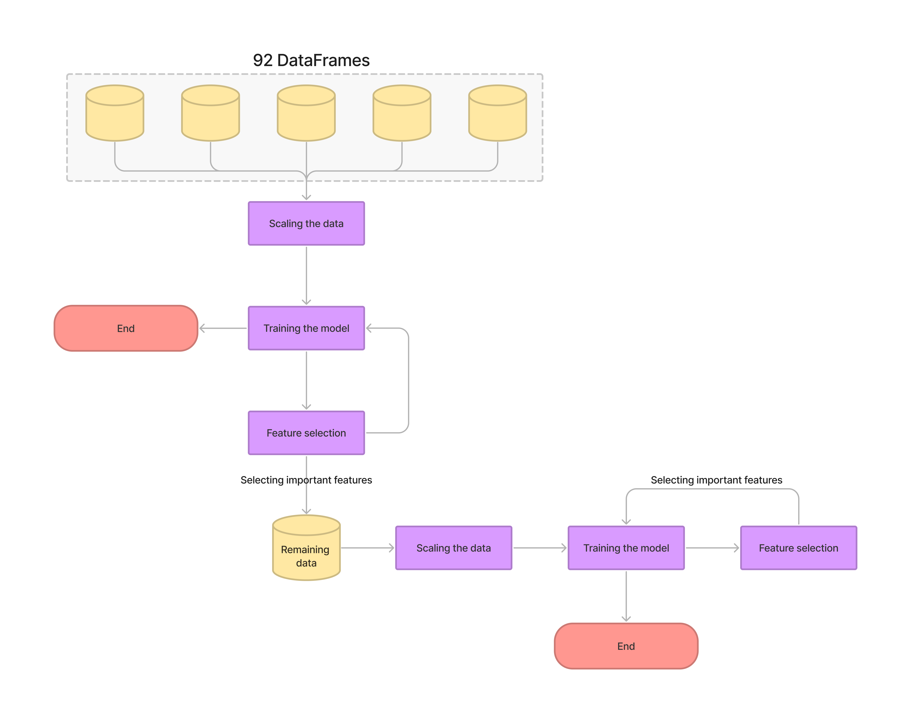

# Predictive Maintenance in Industry 4.0

Welcome to the world of predictive maintenance in Industry 4.0! This project explores the use of advanced analytics and machine learning to predict internal failures in production lines. By leveraging sensor data and historical records, we aim to proactively identify and prevent equipment failures, reducing downtime and optimizing production processes.

## Project Overview

- **Objective**: Analyze a comprehensive dataset from the Bosch challenge to predict internal failures in production lines.
- **Methodology**: Explore predictive maintenance techniques and algorithms, evaluate their effectiveness, and uncover insights.
- **Benefits**: Enhance equipment effectiveness, reduce costs, and optimize production in the Industry 4.0 landscape.

In this README, we'll provide an overview of our project's key components and findings, sharing valuable insights into the world of predictive maintenance.
## Dataset

### Overview

For this project, we utilized a substantial dataset provided by Bosch, which includes the following data types:

- Numerical features
- Categorical features
- Date stamps
- Labels indicating whether a part is good or bad

Here are some key statistics about the dataset:

- **Size**: The dataset is extensive, totaling 14.3 GB in size.
- **Training Data**: It consists of 1,184,687 samples that were used to train our predictive model.
- **Test Data**: The trained model was then used to predict a test dataset, which contains 1,183,748 samples.
- **Features**: The dataset includes a challenging mix of features, including:
  - 968 numerical features
  - 2,140 categorical features
  - 1,156 date features

### Data Processing Challenge

One of the major challenges of this project was processing this diverse set of features to extract meaningful information. The sheer volume and complexity of the dataset required careful preprocessing to prepare it for building a predictive model. In our analysis, we will explore the techniques and methods used to address this challenge and make the data usable for predictive modeling.

## Data Wrangling

Data wrangling is a critical step in this project due to the unique characteristics of the dataset. Here, we outline the challenges faced and the methods employed to prepare the data for analysis and model training.

### Challenges

The dataset's characteristics posed several challenges:

- **High Dimensionality**: The data is high-dimensional, comprising numerical, categorical, and date features.
- **Sparsity**: The dataset is sparse, with missing values indicating that certain samples never passed through specific features.
- **Imbalance**: A significant class imbalance exists, with a vast majority of products not failing.

### Clustering by Product Class

To address these challenges, we adopted a clustering approach based on product classes:

- **Clustering**: Samples that passed through the same features were grouped into clusters, each representing a product class.
- **Imbalance Threshold**: A threshold of 15 failed samples was set to ensure that each product class had sufficient failed samples for model training.
- **Advantages**: This approach reduced computational complexity, improved model accuracy, and ensured that all available data was utilized effectively.

### Handling Imbalance

To tackle the class imbalance, we employed the Synthetic Minority Over-sampling Technique (SMOTE):

- **SMOTE**: This oversampling technique generates synthetic data points based on the original data, mitigating the overfitting issue associated with simple oversampling.
- **SMOTETomek**: For the remaining data, we used SMOTETomek, a hybrid method combining under-sampling (Tomek) with oversampling (SMOTE).

These sampling techniques addressed the imbalance and reduced dimensionality while enhancing the quality of the dataset for model training.

The data wrangling process played a pivotal role in preparing the dataset for predictive modeling, ensuring that the model is robust and capable of making accurate predictions on real-world data.

## Model Training

The image above provides an illustrative representation of our model training process.

## Results and Discussion

### Model Performance

- **Accuracy Range**: The models achieved accuracy scores ranging from 50% to 100%.
- **MCC Score**: The Matthews Correlation Coefficient (MCC) score for the 92 models was an impressive 0.9945.
- **Good Performance**: The majority of the models performed well, with high accuracy and MCC scores.
- **Sample Size Impact**: Some models performed poorly due to small sample sizes. However, these samples contained more failed instances, suggesting that increased data availability for those products could lead to improved model accuracy.

### Training Time

- **Full Data**: Training the model on the remaining data before feature selection took 301 seconds.
- **Accuracy**: The model achieved accuracy scores between 98.5% to 98.7% with a MCC score of 0.974.
- **Feature Selection**: After feature selection and training the model on only 20 crucial features:
  - **SMOTE Time**: Overpopulating the minority class using SMOTE took 638 seconds.
  - **Model Training Time**: Model training required only 17 seconds.
  - **Time Reduction**: The feature selection reduced model training time by 94.35%.
  - **Accuracy Range**: Accuracy remained between 96.32% to 96.53% with an MCC score of 0.931.

These results showcase the model's strong performance and the significant impact of feature selection on reducing training time while maintaining high accuracy. Further improvements could be achieved with more data for products with small sample sizes.

## Managerial Implications

### Computational Resource Optimization

- **Efficiency and Accuracy**: Our project demonstrated that multi-product manufacturing lines can accurately identify internal faults with the help of sampling methods and data pretreatment.
- **Computational Cost**: However, we acknowledge that our proposed solution is computationally costly and demands substantial computing power.

### Decision-Making for Managers

- **Cost-Benefit Analysis**: Managers overseeing multi-product production lines in manufacturing environments must conduct a cost-benefit analysis of different defect detection strategies against available computational resources.
- **Recommendation**: Based on our research, we recommend that managers prioritize the most computationally efficient alternative that still achieves the required accuracy.
- **Consider Resource Requirements**: Carefully consider the computational resources needed by different methodologies when making decisions.

### Infrastructure Considerations

- **Hardware and Cloud Solutions**: To optimize computational costs and boost productivity, managers may need to invest in hardware improvements or consider cloud-based computing solutions.
- **Competitive Advantage**: Optimizing computational resources can result in cost savings, increased productivity, and enhanced competitiveness within the manufacturing sector.

Our findings underline the importance of aligning defect detection strategies with available computational resources to make informed decisions that balance accuracy and efficiency in manufacturing environments.

## Contribution to Existing Research

### Bridging the Gap

While many studies have explored methods for predicting internal failures in production lines, our project addresses critical gaps in the literature:

- **Accuracy vs. Efficiency Trade-Off**: We emphasize the trade-off between accuracy and computational efficiency, an aspect that hasn't been extensively studied in this context. Many existing methods rely on computationally expensive techniques like deep learning, which may be challenging to implement in real-world manufacturing settings.

- **Multi-Product Production Lines**: Our focus on multi-product production lines is distinct. Existing research often centers on single product lines or assumes homogeneous product flows, which may not align with the complexities of real-world multi-product production environments.

### Research Potential

Our work stands out as it addresses the need for more literature in this specific area:

- **Contributing to Efficiency**: By exploring the accuracy-computational efficiency trade-off, we aim to identify more efficient and cost-effective approaches for predicting internal failures in real-world manufacturing settings.

- **Multi-Product Focus**: Our research directly contributes to the development of more effective methods for predicting internal failures in multi-product production lines.

Our project has the potential to pave the way for more practical and impactful solutions in the realm of predicting internal failures in complex manufacturing scenarios.
